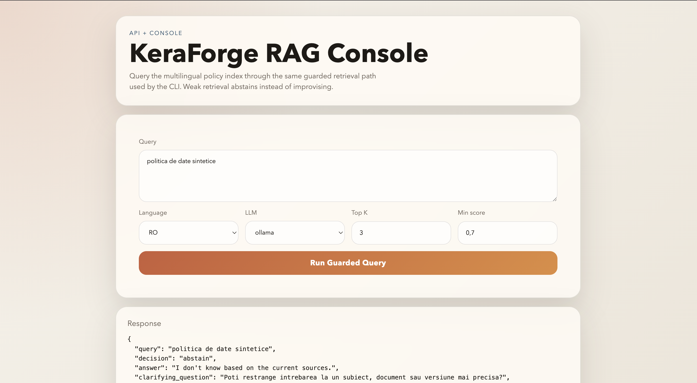

# keraforge

## Run qdrant locally

```bash
docker compose up -d
docker ps
curl -s http://localhost:6333/ | head # SANITY CHECK
```

## Python environment

```bash
python3 -m venv .venv
source .venv/bin/activate
python -m pip install --upgrade pip

pip install qdrant-client sentence-transformers python-frontmatter python-dotenv \
  llama-index llama-index-vector-stores-qdrant llama-index-embeddings-huggingface \
  llama-index-llms-ollama fastapi uvicorn
```

Copy the local config template and set your own keys if you need OpenAI:

```bash
cp .env.example .env
```

For a MacBook Air/Pro with Apple Silicon and 8 GB RAM, use a small Ollama model:

```bash
ollama pull qwen2.5:1.5b-instruct
```

## Ingest docs

```bash
source .venv/bin/activate

python scripts/ingest.py --docs docs
python scripts/ingest.py --docs docs --device mps
python scripts/ingest.py --docs docs --device cpu --batch_size 4
```

The defaults are tuned down automatically on Apple Silicon:

- smaller chunk size
- smaller embedding batch size
- smaller Qdrant upsert batches
- smaller RAG retrieval/context defaults
- default Ollama model fallback: `qwen2.5:1.5b-instruct`

## Semantic search

```bash
python scripts/search.py "politica de date sintetice" --lang RO
python scripts/search.py "zasady zgodności danych" --lang PL
python scripts/search.py "compliance synthetic datasets" --lang EN
```

If `mps` is unstable on your machine, force CPU:

```bash
python scripts/search.py "politica de date sintetice" --lang RO --device cpu
```

## RAG query

```bash
source .venv/bin/activate
python scripts/rag_query.py "politica de date sintetice" --lang RO --llm ollama
python scripts/rag_query.py "zgodność dane syntetyczne" --lang PL --llm ollama --device cpu
```

Guardrails are built into `scripts/rag_query.py`:

- explicit retrieval assessment before generation
- abstain behavior when retrieval is weak
- clarifying follow-up question on abstain
- provenance output with document name and chunk id

You can tune the trust thresholds from the CLI:

```bash
python scripts/rag_query.py "politica de date sintetice" --lang RO --llm ollama \
  --top_k 2 --max_context_chars 900 --min_score 0.35 --min_avg_score 0.25
```

## API

Run the local API:

```bash
source .venv/bin/activate
uvicorn app.main:app --reload
```

Open the local console:

```bash
open http://127.0.0.1:8000/
```

Example request:

```bash
curl -s http://127.0.0.1:8000/query \
  -H "Content-Type: application/json" \
  -d '{
    "query": "politica de date sintetice",
    "lang": "RO",
    "llm": "ollama",
    "top_k": 2,
    "max_context_chars": 900
  }'
```

Example response shape:

```json
{
  "query": "politica de date sintetice",
  "decision": "grounded",
  "answer": "...",
  "clarifying_question": null,
  "assessment": {
    "grounded": true,
    "reasons": ["ok"],
    "top_score": 0.63,
    "avg_score": 0.63,
    "distinct_docs": 1,
    "retrieved_nodes": 1
  },
  "citations": [
    {
      "n": 1,
      "score": 0.63,
      "title": "Politică de generare a datelor sintetice",
      "src": "docs/policy_ro.md#chunk=0"
    }
  ],
  "latency_ms": 1234.56
}
```

## Troubleshooting

```bash
pip show qdrant-client
pip install -U qdrant-client
```

`scripts/search.py` already handles both older `search()` and newer `query_points()` Qdrant client APIs.

If Ollama says the model is missing, pull it first:

```bash
ollama pull qwen2.5:1.5b-instruct
```
## Demo

